# Atividade Docker + CI — Letícia Alves dos Santos

**Aluno(a):** Letícia Alves dos Santos  
**Turma:** Iteam Noite  
**Data:** 23/07/2026  
**Aplicação usada:** docker/getting-started-app (To-Do em Node.js)

---

# 1. Como executar este projeto

```bash
git clone https://github.com/letxiz/docker-ci-lab.git
cd docker-ci-lab

cp .env.example .env

docker compose up -d --build
```

Acesse:

```
http://localhost:3000
```

Para parar os containers:

```bash
docker compose down
```

Para remover também os volumes:

```bash
docker compose down -v
```

---

# 2. Imagem e Dockerfile Multi-stage

## Estágios utilizados

- **Builder:** responsável por instalar as dependências e preparar a aplicação.
- **Final:** gera uma imagem menor contendo apenas os arquivos necessários para execução.

## Imagem base

```
node:20-alpine
```

## Usuário de execução

```
node (não-root)
```

## Tamanho final da imagem

```
286 MB
```

## Por que utilizar multi-stage?

O multi-stage build reduz o tamanho da imagem final ao remover arquivos temporários e dependências utilizadas apenas durante o processo de construção, tornando a aplicação mais leve, segura e eficiente.

## Print 1

Build da imagem Docker.

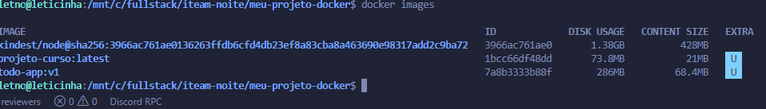

---

## Print 2

Aplicação em execução.

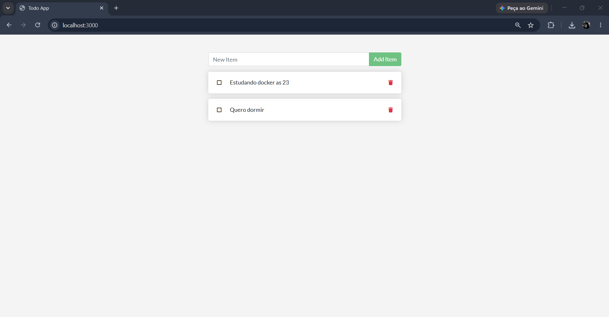

---

# 3. Volumes e Persistência

## Volume utilizado

```
todo-db
```

## Diretório utilizado

```
/etc/todos
```

## Print 3

Com volume: os dados permanecem armazenados mesmo após recriar o container.

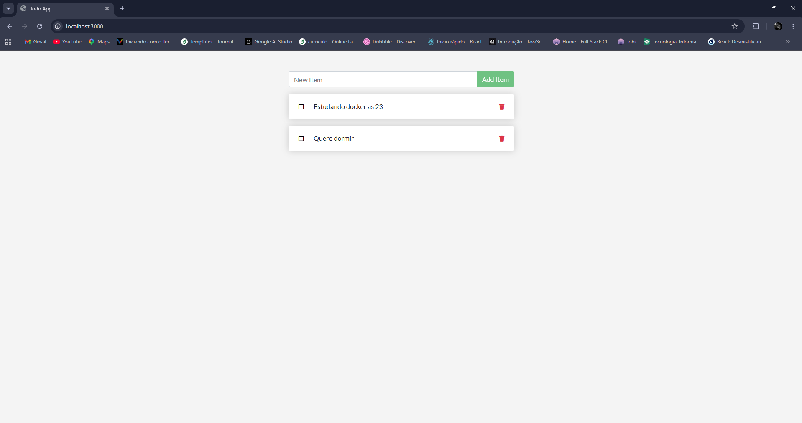

---

## Print 4

Sem volume: ao remover o container, os dados são perdidos.

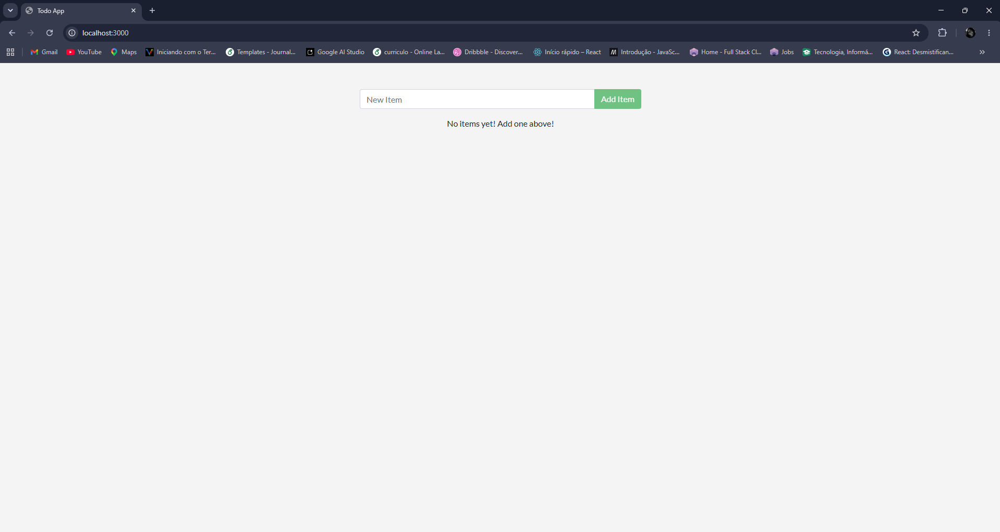

---

## Diferença entre `docker compose down` e `docker compose down -v`

- **docker compose down**: remove apenas os containers, preservando os volumes.
- **docker compose down -v**: remove os containers e também os volumes, apagando todos os dados persistidos.

---

# 4. Rede

## Rede criada

```
todo-net
```

## Containers conectados

- app
- db

## O banco de dados ficou exposto ao host?

Não. Apenas a aplicação consegue acessá-lo através da rede Docker.

## Como a aplicação encontra o banco usando apenas o nome `db`?

O Docker possui um DNS interno que resolve automaticamente o nome do serviço para o container correspondente.

## Print 5

Rede criada.

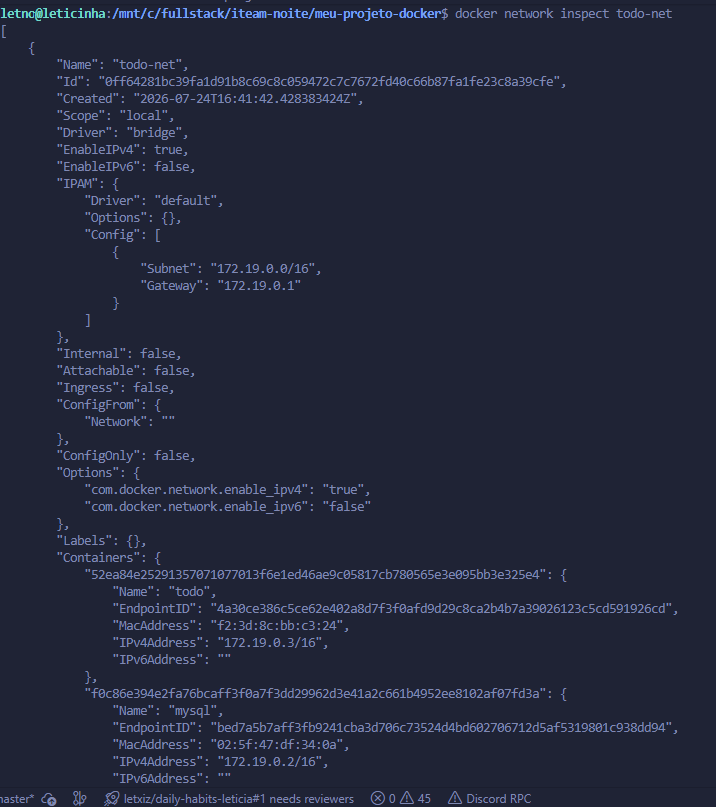

---

## Print 6

Container MySQL em execução.

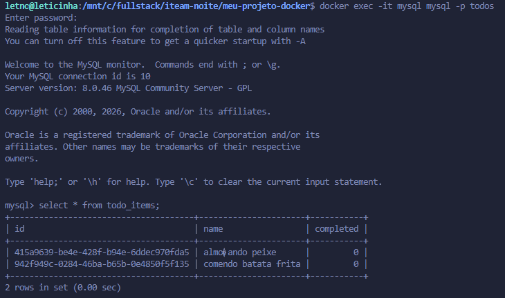

---

# 5. Docker Compose

## Serviços

- app
- db

## Rede

```
todo-net
```

## Volume

```
todo-db
```

## Healthcheck

Foi utilizado um **healthcheck** para garantir que o banco esteja pronto antes da inicialização da aplicação.

## depends_on

```
condition: service_healthy
```

## Variáveis de ambiente

As credenciais foram armazenadas no arquivo `.env`. Apenas o arquivo `.env.example` foi versionado no GitHub.

## Print 7

Aplicação funcionando utilizando Docker Compose com persistência dos dados.

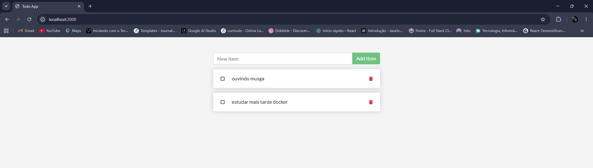

---

## Print 8

Reset da persistência após executar `docker compose down -v`, demonstrando que o volume foi removido e os dados anteriores foram apagados.

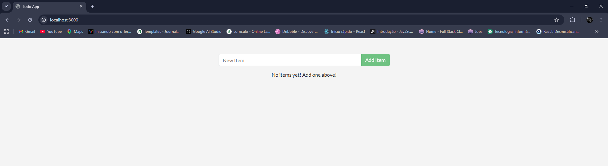

---

# 6. GitHub Actions

## Workflow

```
.github/workflows/ci.yml
```

## Gatilhos

- push
- pull_request

## Etapas executadas

1. Validação do Docker Compose.
2. Build da imagem.
3. Inicialização da aplicação.
4. Execução do Smoke Test.
5. Finalização da stack.

## Print 9

Pipeline executado com sucesso.

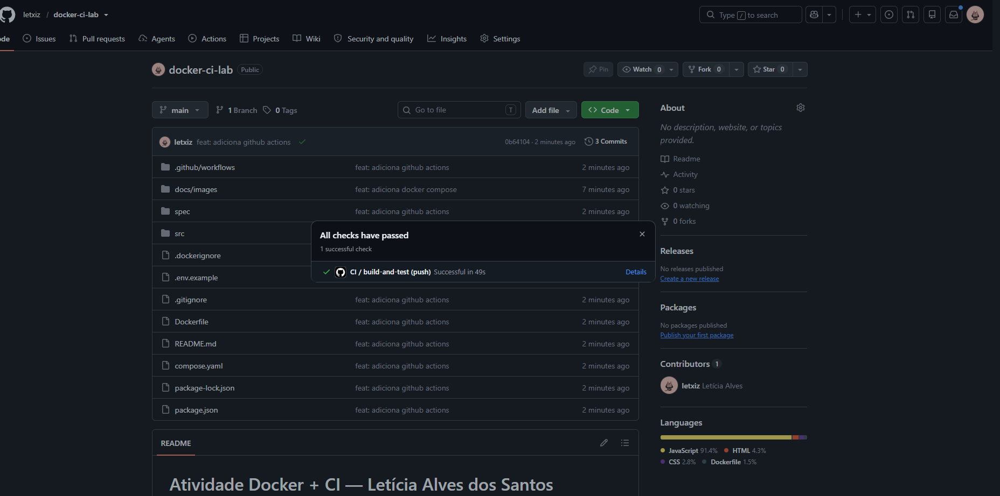

---

# 7. Quebra proposital do CI

## O que foi quebrado?

Foi alterado propositalmente o arquivo `.env.example`, modificando uma variável de ambiente para provocar uma falha na execução do pipeline de Integração Contínua.

## Erro encontrado

A alteração fez com que a aplicação não fosse inicializada corretamente durante a execução do GitHub Actions, ocasionando a falha do workflow.

## Como o CI reagiu?

O GitHub Actions interrompeu automaticamente a execução do pipeline e marcou a execução como falha (**❌**), exibindo os logs para facilitar a identificação do problema.

## Print 10

Pipeline com falha após a quebra proposital.

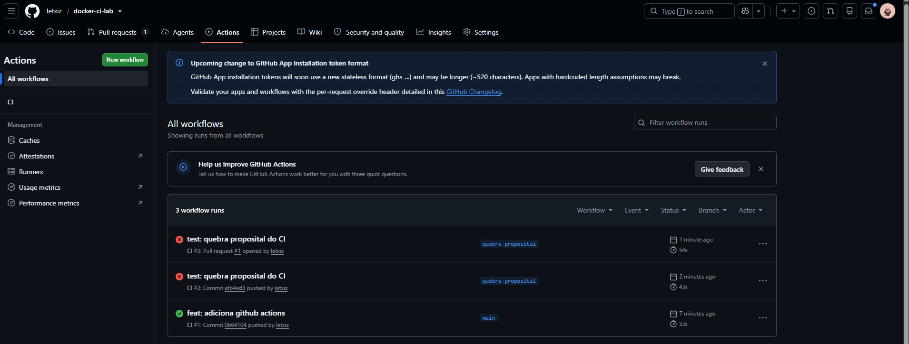

---

## Como foi corrigido?

O arquivo `.env.example` foi restaurado com as configurações corretas. Após realizar um novo commit e push, o pipeline foi executado novamente com sucesso.

## Print 11

Pipeline executado com sucesso após a correção.

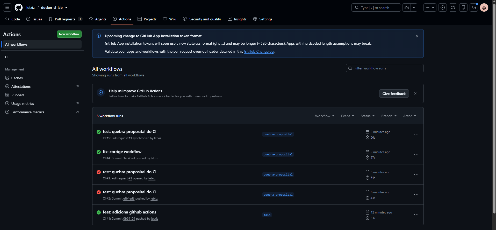

---

## Link do Pull Request

https://github.com/letxiz/docker-ci-lab/pull/1

---

# 8. Dificuldades e aprendizados

Durante a atividade foi possível compreender o funcionamento do Docker desde a criação de imagens utilizando **multi-stage build** até a execução da aplicação em containers.

Também foi possível aprender sobre a utilização de **volumes** para persistência de dados, **redes Docker** para comunicação entre containers e **Docker Compose** para orquestração dos serviços.

Além disso, a utilização do **GitHub Actions** mostrou como a Integração Contínua automatiza a validação da aplicação, permitindo identificar erros rapidamente e garantindo maior confiabilidade no processo de desenvolvimento.

A etapa de quebra proposital do pipeline permitiu visualizar, na prática, como o CI interrompe automaticamente a execução quando encontra erros de configuração.

---

# 9. Checklist

- [x] Dockerfile multi-stage
- [x] .dockerignore
- [x] Container utilizando usuário não-root
- [x] Volume nomeado
- [x] Persistência demonstrada
- [x] Rede criada
- [x] Docker Compose
- [x] Arquivo `.env.example`
- [x] GitHub Actions
- [x] Pull Request com pipeline vermelho → verde
- [x] Todos os prints adicionados